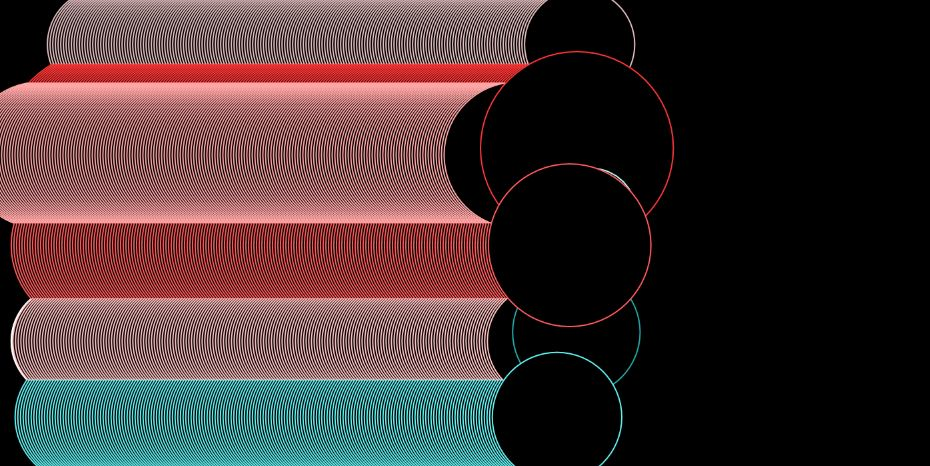

# Miniex6 - I'm not done writing yet! 
I have made a generative program using the random function, a  for loop and conditional statements. I also used the principle of classes and objects which we learned last week. The rules of my program are: 

1. The circles are generated at random positions.  
2. The circles are generated in random colors. 
3. The circles are generated in random sizes. 
4. The circles move along the x-axis until they hit the edge of the screen
5. When the circles hit the edge of the screen they go backwards with a slight drop in the y-axis causing them to move diagonally. 

https://cdn.rawgit.com/CathrineVilain/Miniex6/c0182eef/p5/empty-example/index.html
